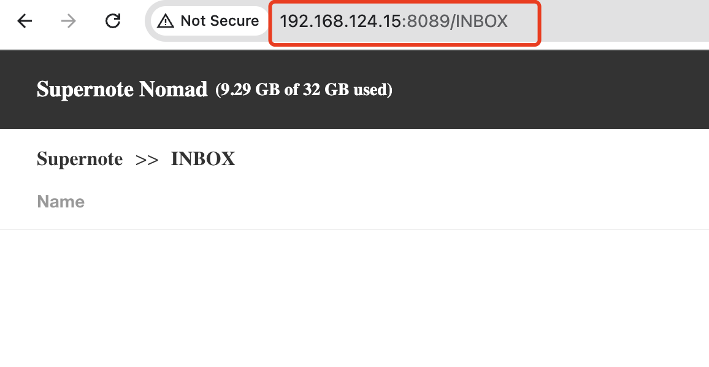
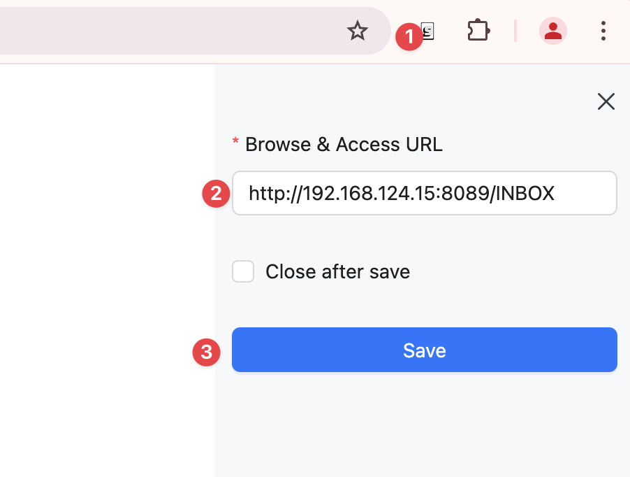

# How to use the Send to E-Reader

## 1. Install the Send to E-Reader Extension

You can install the Send to E-Reader extension from the [Chrome Web Store](https://chromewebstore.google.com/detail/send-to-ereader/ebcaniifiemifccnfogcoghclamaccbf?hl=en-US&utm_source=ext_sidebar).

## 2. Setup Supernote Browse & Access

You can follow the instructions on the [Supernote website](https://support.supernote.com/en_US/Tools-Features/wi-fi-transfer) to setup Supernote Browse & Access.

## 3. Open the folder you want to send to your e-reader, and Copy the URL

### 4. Open the web page you want to send to your e-reader

+ Click on the Send to E-Reader extension icon in the top right corner of your browser.
+ Input the URL you copied in step 3.
+ Click on the "Send" button.

The web page will turn into an EPUB file and be sent to your e-reader.

